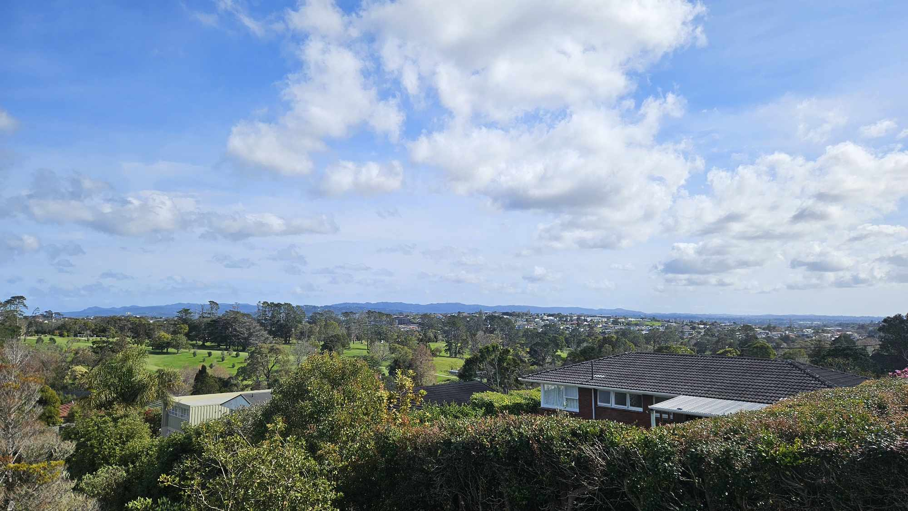

# Outside a property

Work your way outside in, this lets you get a good understanding of the property, its grounds, and the surrounding area. Check the building materials, the land area, surrounding structures, slope, and anything else that may be a criterion for you.

## Your Neighbours

This is actually the first thing I look at. How far away are the neighbouring houses, and how close could they get if they demolished and re-built? I am incredibly fussy here so I only buy properties to live-in that have at-least 7 metres of space from my wall to the next door legal building limit (about 1m inside their boundary). This obviously rules out most of Auckland so don't follow my lead, but your neighbours are a really important factor, things to consider:

1. **Privacy:** How close are they to you and how? You don't want their deck looking into your bathroom, and needless to say, vice versa!
2. **Future plans:** If they are a THAB zoned property that's north of yours, they can build an apartment and block most of your sunlight (despite the sun planes rules, etc), so have a think.
3. **Future neighbours:** If your neighbours sell and go, be mindful that you may have a rowdy flat you'll need to put up with and what that looks like from a noise perspective. E.g. is your bedroom near their living room?
4. **The area:** Stand on the street on a Friday night and see how you feel. Would you walk in the area alone at night time with your puppy?

## The view

What kind of view do you get from the property? Again, this is an important one for me - you don't want to be facing your neighbours garage or a rubbish truck every Friday morning drinking your coffee. Have a think about what kind of lifestyle and outlook works for you.&#x20;

<figure><figcaption>
The view from my living room - Maungakiekie Golf course in the foreground, Waitakere ranges in the background.
</figcaption></figure>

## Orientation

The orientation of the house is quite important and not something you can easily change. **North facing** houses are generally better because of the natural sunlight that can come in. Rooms that face north will get plenty of sun while rooms that face south won't. Generally, I prefer houses where the garage and bathrooms are south, and the living areas are to the north. I'm not too fussed about the bedrooms but each to their own.

<figure><figcaption></figcaption></figure>

## Parking

This is really dependent on your lifestyle, but Auckland remains a very car-centric city, with a third world public transport system. This means despite our hopes and your protests, you will likely need a car, or 2 for your household. The problem is the new Auckland design standards don't require consideration for off-street parking with new developments and renovations. When buying, look at the off-street parking situation carefully. Do not factor in on-road parking as these can be removed or charged for at any time, and anyone can park there.

Also consider manuvering. Is it easy to drive in, do a U-Turn, and drive out again? You don't want to be reversing on to a main road, or reversing into your driveway, every single day.&#x20;

Many homes have shared driveways. In this case, factor in what exclusive space you have for your car. Can you wash your car without blocking anyone else?

## Building

1. Building materials - Are they using high quality brands like Marley and quality fittings?
2. &#x20;Drainage, guttering, and spouting - Internal or external? Any sags, rust or issues? Plastic or metal?
3. Building exterior – Are the weatherboards lined well? Does the house look well put together?
4. Under the house – Do the piles look ok? Is there dampness? Is anything at a wrong angle?
5. Retaining walls – Is there any sagging? Is something bending that shouldn’t be?
6. Access and paths – Are they well defined and easily accessible?
7. Trees – Are there any big trees that pose a danger?
8. Shared spaces – How close are the neighbours and what do they share with you?
