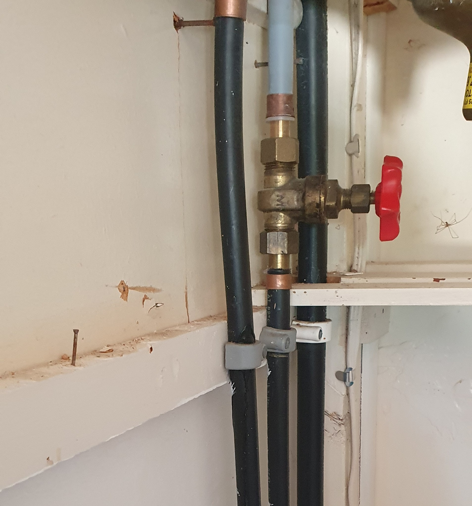

# Plumbing and Electrical

Plumbing and wiring will vary based on the era the house was constructed. If you’re looking at pre-1960s property, make sure the house has been re-wired and re-plumbed. Older wiring does not meet today’s building standards or electrical load, and can present a safety risk. Older plumbing may also have leaks or other complications. Again, this is an area where you don't want to have an expert opinion, but having general knowledge will help you greatly.&#x20;

## Switchboard

Check the switchboard and see if its old or new. If it is an old school black asbestos backed board, with fuses instead of switches, you may need to consider replacing the switchboard sooner or later. Ask your licensed building professional or electrician for further advice.&#x20;

3

<figure><figcaption>
Spot the difference
</figcaption></figure>

## Dux Quest Plumbing

When you check a building’s plumbing and you see black pipes with a white stripe running down the side, be worried. Check for identifying markets for Dux Quest. These pipes were very common in the late 1960s to 1980s and are renowned for leaking. Some insurance companies won’t cover damage from this sort of leak, and most certainly won’t cover round 2 leaks.

**Jay's note:** I knowingly purchased my house with dux quest plumbing. It decided to leak on the morning of easter weekend, a public holiday - when all of us were flying out, all the plumbers were taking a break, and Bunnings was closed. Luckily we found someone to fix it, but the damage was done.

<figure><figcaption></figcaption></figure>

## Certificate of Compliance (COC)

Ensure that any renovations the home-owner has done have a valid COC provided. If there is a future fault, your insurance company will ask to see the COC, especially if they deem the work to be uncompliant in the future.

* Plumbing
* Gas
* Electrical
* Licensed building work
